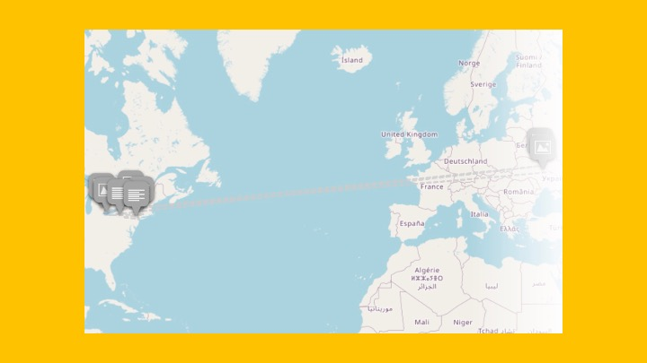
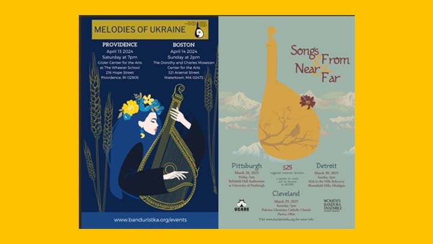
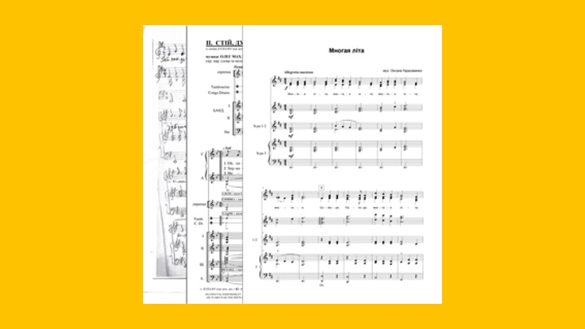

# **Women of Bandura**

<section>
  

      <ol class="carousel-indicators">
        <li data-target="#carouselExampleIndicators" data-slide-to="0" class="active"></li>
        <li data-target="#carouselExampleIndicators" data-slide-to="1"></li>
        <li data-target="#carouselExampleIndicators" data-slide-to="2"></li>
        <li data-target="#carouselExampleIndicators" data-slide-to="3"></li>
      </ol>
      

        

          
          

          

        

        

          
          

            <a class="btn btn-primary" href="/wax/about/history/" role="button">StoryMap</a>
          

        

        

          
          

            <a class="btn btn-primary" href="/wax/programs/" role="button">Programs</a>
          

        

        

          
          

            <a class="btn btn-primary" href="/wax/songs/" role="button">Songs</a>
          

        

      

      <a class="carousel-control-prev" href="#carouselExampleIndicators" role="button" data-slide="prev">
        
        Previous
      </a>
      <a class="carousel-control-next" href="#carouselExampleIndicators" role="button" data-slide="next">
        
        Next
      </a>
      

        
        

          <h5>...</h5>
          
...

        

      

  

</section>

 
Women of Bandura is a digital program archive created in collaboration with the Women's Bandura Ensemble of North America (WBENA) to highlight 
the contribution of the section of society traditionally excluded from the specific performance culture. Women have and continue to play a vital role in advancing the rich history represented by the instrument that has been synonymous with Ukrainian identity.  
